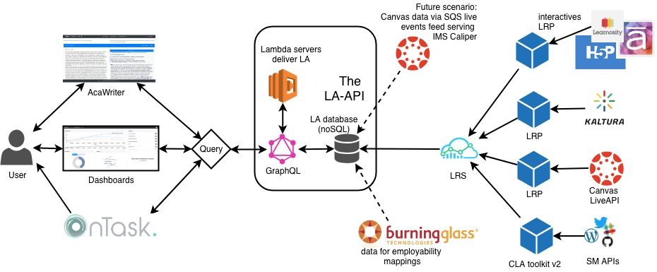

# la-graphql-api

The LA-API provides an interface between educational data sources and learning analytics tools. GraphQL is used to modularise dependencies, providing flexibility for extending both sides of a complex learning ecosystem.

## Setup

- requires node v10.2, npm, git installed
- git clone repo ``https://github.com/uts-cic/graphql-la-api.git``
- ``npm install``
- ``cp .env.default .env``
- update .env
- ``npm start ``
- This will start server http://localhost:8080/graphql

## Stack used
- node
- npm
- graphql
- express
- mongoose

### Project Structure

    .
    ├── models                  # stores all the mongoDB schemas for collections
    ├── services                # stores files for connecting to third party api's
    ├── .env                    # stores all configurable parameters like DB usernames, passwords etc (added to .gitignore)
    ├── index.js                # entry point for the graphql server
    ├── resolvers.js            # resolvers for fileds names specified in the graphql schema
    ├── schema.js               # graphql SDL
    ├── package.json            # npm packages required
    ├── LICENSE
    └── README.md

## Development

``npm start`` will start nodemon and will keep checking for changes in the files and reload the server automatically
For Production use PM2, forever or similar to keep node running.

## Contributions

- Fork the repo.
- Merge changes into the repo on a separate branch

### FAQ
	To add a new service
- Decide the required output and add it to the `schema.js`
`` type Book {
    name: String
    author: String
 }
 ``
- Add the query ``type {Query  { getBooks() : Book } }``
- Next need to resolve the query so go to resolver.js and add a function getBook() to fetch all the books.
- Data source for the Book may be either mongoDB or any other database or a third part API
	- if MongoDB -> create a model (schema) for the book collection like by creating a new file under `models/book.js`.  replicate the code in `models/note.js` or `models/user.js` and update the fields *Note: this is the database schema and not the graphql schema we defined above*.
	- if Third Party API (REST or GraphQL) create a file under `services/book.js` (name could be anything). Use node fetch, http, or request to fetch book data. `npm isntall` required packages or consider using https://www.apollographql.com/docs/apollo-server/v2/features/data-sources.html
	- if another database (postgresql or mysql or any other db), create a model under models/book.js to match the table schema and export it.
- import all the newly created models (db schema) into `resolver.js` or add it to the datasources like (https://github.com/uts-cic/la-graphql-api/blob/5f927804bd435c3bedfbdba91a0cf38cd04f2689/index.js#L41). This will make the datasource (functions) available in the `resolver.js`
- Check the graphql API output.

**Note**: *This is just a quick easy way to get started, please feel free to experiment and play around to get optimised results.*

	Update the port number
Update `const PORT = 9000` in `index.js`

	Update MongoDB Port
Update `line 18 :27017 to the port mongodb is running on` in `index.js`
